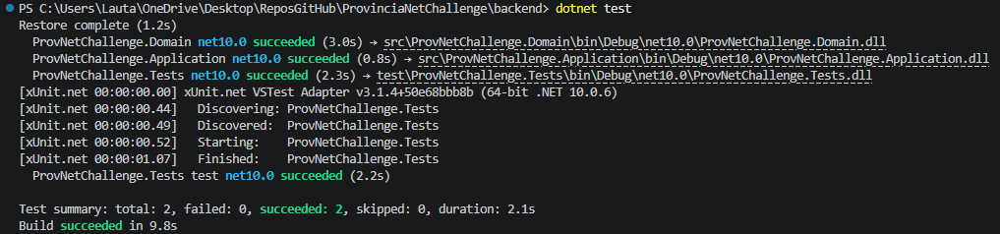

# 📦 Provincia NET Challenge - API de Gestión de Inventario

Esta solución implementa una API RESTful para la gestión de un inventario, desarrollada como parte del desafío técnico para Provincia NET. El proyecto está enfocado en aplicar buenas prácticas de ingeniería de software, arquitectura escalable y una experiencia de despliegue sin configuraciones (Zero-Config).

## 🚀 Tecnologías y Herramientas

* **Framework:** .NET 10 (C#)
* **Base de Datos:** SQL Server 2022
* **ORM:** Entity Framework Core (Code-First)
* **Arquitectura:** Clean Architecture
* **Testing:** xUnit & Moq
* **DevOps:** Docker, Docker Compose & GitHub Actions (CI/CD)

## 🏗️ Arquitectura del Sistema

El backend está estructurado siguiendo los principios de **Clean Architecture**, dividiendo las responsabilidades en 4 capas estrictas para garantizar un bajo acoplamiento y alta cohesión:

1. **Domain:** Entidades del núcleo del negocio (`Product`, `User`) e interfaces base. No tiene dependencias externas.
2. **Application:** Lógica de negocio, Casos de Uso (Services), DTOs y validaciones.
3. **Infrastructure:** Implementación de persistencia (Repositories) y contexto de Entity Framework.
4. **WebApi:** Controladores REST, inyección de dependencias, configuración de JWT y Middleware global.

## ✨ Características Destacadas

* **Autenticación y Autorización:** Implementación de seguridad mediante JSON Web Tokens (JWT) para proteger los endpoints.
* **Manejo Global de Excepciones:** Middleware interceptor personalizado (`ErrorHandlerMiddleware`) para centralizar el manejo de errores y devolver respuestas HTTP estandarizadas (Evitando `try-catch` redundantes en los controladores).
* **Migraciones Automáticas:** La base de datos y sus tablas se generan y actualizan automáticamente al arrancar el contenedor mediante `dbContext.Database.Migrate()`.
* **Pruebas Unitarias:** Cobertura de la lógica de negocio (Servicios) utilizando `xUnit` y `Moq` mediante el patrón AAA (Arrange, Act, Assert).

## ⚙️ Integración y Despliegue Continuo (CI/CD)

El proyecto cuenta con un flujo de CI/CD automatizado mediante **GitHub Actions**.
Cada vez que se realiza un *push* a la rama `main`, un workflow compila el código y publica la imagen Docker optimizada directamente en Docker Hub (`lautarorojas/provnetchallenge-api:latest`). El archivo `docker-compose.yml` está configurado para consumir esta imagen productiva.

## 🏃‍♂️ Cómo ejecutar el proyecto (Zero-Friction)

El proyecto está diseñado para ser evaluado sin necesidad de instalar SDKs de .NET ni configurar servidores locales.

### Requisitos previos

* [Docker Desktop](https://www.docker.com/products/docker-desktop/) instalado y en ejecución.

### Pasos

1. Clonar el repositorio o descargar solo el archivo [`docker-compose.yml`](https://github.com/lautaro-rojas/ProvinciaNetChallenge/blob/main/backend/docker-compose.yml).
  
    ```bash
    git clone https://github.com/lautaro-rojas/ProvinciaNetChallenge.git
    ```

2. Abrir una terminal en la raíz del proyecto (donde se encuentra el archivo `docker-compose.yml`).

   ```bash
    cd ProvinciaNetChallenge
    ```

3. Ejecutar el siguiente comando:

   ```bash
   docker-compose up -d
   ```

4. Esperar unos segundos a que la base de datos se inicialice. La API esperará automáticamente a que SQL Server esté "Healthy" antes de aceptar conexiones.

5. Navegar a http://localhost:8080/scalar para interactuar con los endpoints.

6. Para detener y limpiar los contenedores, ejecuta:

    ```bash
    docker-compose down
    ```

### ⚠️ Nota sobre Seguridad y Variables de Entorno

Tengo pleno conocimiento de que, en un entorno de Producción real, estos datos sensibles jamás deben versionarse en el repositorio. En un escenario corporativo estándar, utilizaría archivos .env ignorados en Git o un gestor de secretos (como Azure Key Vault) inyectados durante el pipeline de despliegue.

## 🧪 Detalle de las Pruebas Realizadas

Se implementaron pruebas unitarias sobre la capa de **Application** (específicamente en `ProductService`) para aislar y validar la lógica de negocio central, sin depender de la base de datos. Se utilizó el framework **xUnit** en combinación con **Moq** siguiendo el patrón AAA (Arrange, Act, Assert).

**Casos de prueba evaluados:**

1. `AddAsync_WithExistingSku_ShouldThrowBadRequestException`: Valida que el sistema rechace la creación de un producto si el SKU ingresado ya se encuentra registrado, comprobando que se lance la excepción de negocio correcta (`BadRequestException`) y que no se llame al repositorio de escritura.

2. `AddAsync_WithNewSku_ShouldReturnNewProductId`: Verifica el "camino feliz", asegurando que al ingresar datos válidos y un SKU inexistente, el servicio se comunique correctamente con el repositorio y devuelva el ID esperado.

A continuación, se adjunta la evidencia de la ejecución exitosa de los tests:


